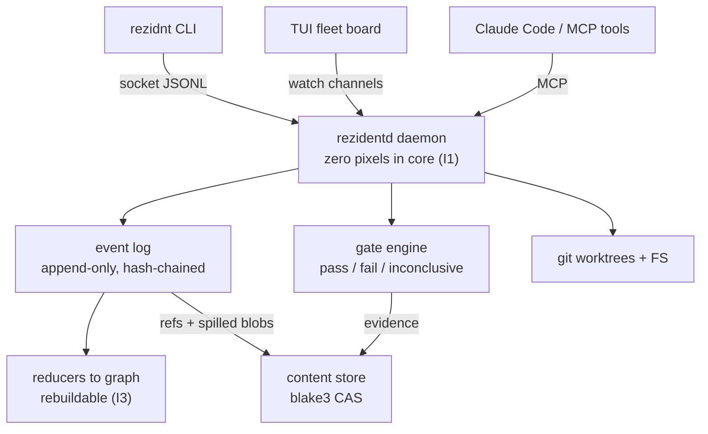

<div align="center">

# rezidnt

**A local-first resident daemon that runs, verifies, and audits a fleet of coding agents.**

One Rust binary. Zero telemetry. Every fact about your fleet is an append-only, replayable event —
and every merged diff carries deterministic evidence a compliance reviewer will sign.

[Architecture](docs/rezidnt-architecture.md) · [Invariants](#the-eight-invariants-binding) · [Golden path](#the-golden-path-the-product-contract) · [Build](#build) · [Status](#status)

`Apache-2.0` · `edition 2024` · `v0.0.1` (pre-release)

</div>

---

## What it is

Three capabilities no current tool unifies, behind one daemon:

- **A typed event fabric** — every fact about the fleet, append-only, hash-chained, replayable. The log *is* the truth; all state is a pure fold over it and can be rebuilt from `seq 0` at any time.
- **A run substrate** — agents and their substrates run under restart-with-backoff supervision, like a session-scoped init. Kill the client mid-run; the daemon owns the process, and the run survives.
- **A verifier gate engine** — deterministic checks that emit *evidence, not vibes*. Verdicts are `pass | fail | inconclusive` — never a coerced boolean. `debrief` replays a recorded verdict from the log + content store; a divergence raises an integrity alarm.

Positioning, in one line: **Omnigent governs what an agent _may_ do; rezidnt proves what it _did_.**

## How it fits together

Every UI is a client of the socket/MCP surface — the daemon itself renders nothing (I1). This diagram answers: *how does an agent reach the daemon, and what does the daemon own?*



Control plane and data plane never mix (I2): the fabric carries facts and references; PTY bytes, diffs, and transcripts move out-of-band through the content-addressed store.

## The golden path (the product contract)

The whole project is judged against one demo, not a feature list — cold machine to first verified merged diff, one take, zero config edits, single-digit minutes. This is **BINDING**.


## The eight invariants (BINDING)

These are the load-bearing constraints; changing one requires a written decision record. Full text: [architecture §2](docs/rezidnt-architecture.md).

| # | Invariant | What it forbids |
|---|---|---|
| **I1** | Zero pixels in core | the daemon rendering anything; a UI forcing a daemon change |
| **I2** | Control/data plane never mix | PTY/diff bytes on the bus; payloads over 32 KiB (spill to CAS) |
| **I3** | The log is truth, state is derived | any state that can't be rebuilt from the log |
| **I4** | Substrates behind traits | hard-wiring git, herdr, or a harness as non-swappable |
| **I5** | MCP-first, UI-second | shipping a capability as a keybinding before an MCP tool |
| **I6** | Verifiers deterministic + interrogable | a gate that can't say why it blocked; coercing `inconclusive` |
| **I7** | One static binary, no telemetry | runtime deps, phone-home, hosted control plane |
| **I8** | AGPL firewall | reading, linking, or vendoring herdr (AGPL) source |

## Repository map

Cargo workspace, one repo. Library crates are `MIT OR Apache-2.0`; binaries `Apache-2.0`.

```text
rezidnt/
  bins/
    rezidentd/              the daemon — fabric, log, gate engine, socket
    rezidnt/               the CLI (auto-spawns the daemon on first use)
  crates/
    rezidnt-types/         event envelope, subjects, id newtypes
    rezidnt-fabric/        append-only SQLite log, blake3 chain, broadcast, replay
    rezidnt-state/         pure reducers → materialized graph (CQRS-lite)
    rezidnt-proto/         socket protocol frames, versioned hello
    rezidnt-cas/           content-addressed store (blake3)
    rezidnt-run/           run substrate: spawn, capture, reaper, spec parser
    rezidnt-adapters/git/  gix reads, git-CLI mutations, worktree registry
    rezidnt-gate/          gate engine — native + exec verifiers, evidence
    rezidnt-mcp/           MCP server (resources + tools)
    rezidnt-tui/           read-only ratatui fleet board
  spec/
    ontology.md            subject taxonomy — the IP, versioned like code
    fixtures/              golden event-log replay fixtures
  docs/
    rezidnt-architecture.md   canonical design (v0.2 + DR-001..007)
  .claude/                 the build harness (see rezidnt-harness-README.md)
```

## The event model

A single envelope carries every fact ([architecture §5](docs/rezidnt-architecture.md)). Subjects are dot-namespaced, never renamed — only deprecated. Payloads evolve additively; reducers fold every live version.

```rust
pub struct Event {
    pub id: Ulid,                   // time-ordered, globally unique
    pub subject: Subject,           // e.g. agent.status.changed
    pub correlation: Ulid,          // groups one causal chain (an open, a gate run)
    pub causation: Option<Ulid>,    // the event that directly triggered this one
    pub payload: serde_json::Value, // <= 32 KiB; larger content becomes a CAS ref
    // ...id, ts, v, source, workspace
}
```

Materialized state is a pure fold: `fn apply(&mut Graph, &Event)`. `rezidnt rebuild` refolds from `seq 0`; a rebuild that diverges from the running graph is a release-blocking reducer bug.

## CLI

Every verb takes `--json`; exit codes are stable and ratified (DR-004): `0` ok · `1` internal error · `2` local input/usage · `3` substrate fault (incl. daemon refusals & `inconclusive`) · `4` daemon unreachable · `5` gate-fail.

```text
rezidnt open <repo|spec>     materialize a workspace, spawn agents under gates
rezidnt tail [--subject …]   stream the live event fabric
rezidnt board                read-only ratatui fleet board
rezidnt debrief <run>        replay recorded verdicts; alarm on divergence
rezidnt gate why <run>       the failing verifier, evidence, and exact inputs
rezidnt rebuild              refold state from seq 0 and print the graph
```

## Build

Requires a recent stable Rust toolchain (edition 2024).

```bash
cargo build --workspace
cargo test --workspace
```

The full local verifier gauntlet — `fmt`, `clippy -D warnings`, tests, and golden-fixture replay — is one command:

```bash
bash .claude/hooks/vet.sh
```

> **Platform note.** Linux and macOS run natively. On Windows, the Phase-1 topology runs the daemon and substrates inside WSL2 with Windows-side clients reaching it over loopback; a native-Windows daemon (ConPTY, named pipes) is a Phase-3 goal.

## Status

Pre-release (`v0.0.1`). Slices are "done" only when their acceptance criteria pass the gauntlet **and** a read-only auditor's verdict — never a feature checklist.

| Slice | Scope | State |
|---|---|---|
| **S0** | ontology + envelope + log + broadcast + `tail` | ✅ complete |
| **S1** | run substrate + `open` materialization | ✅ complete |
| **S2** | git adapter + sole-allocator worktree registry | ✅ complete |
| **S3** | MCP surface + `attach` | ✅ complete |
| **S4** | gate engine — verified merged diff + replayable `debrief` | ✅ complete (golden path) |
| **S5** | ratatui read-only fleet board | ✅ complete |
| **Phase 3** | owned terminal substrate (VT kernel, native Windows) | demand-gated |

Sequencing law: **fabric → gates → terminal.** Any pressure to reorder gets the phase-exit-demo test.

## Documentation

- **[docs/rezidnt-architecture.md](docs/rezidnt-architecture.md)** — the canonical design: invariants, topology, the fabric and gate engine, the phased roadmap, and decision records DR-001..007. Everything else is its distillation.
- **[spec/ontology.md](spec/ontology.md)** — the subject taxonomy; treated as the crown-jewel IP and versioned like code.
- **[rezidnt-harness-README.md](rezidnt-harness-README.md)** — building rezidnt with the Claude Code agent-team harness (agents, skills, hooks, the maker–checker loop).

## Licensing

Apache-2.0 at the root; `MIT OR Apache-2.0` on `crates/*` libraries. See [`LICENSE`](LICENSE), [`LICENSE-MIT`](LICENSE-MIT), [`CONTRIBUTING.md`](CONTRIBUTING.md) (DCO enforced), [`SECURITY.md`](SECURITY.md), and [`TRADEMARKS.md`](TRADEMARKS.md) (mark owned by TwofoldTech LLC). A `NOTICE` file carrying attributions is added when any third-party code is first ported.
