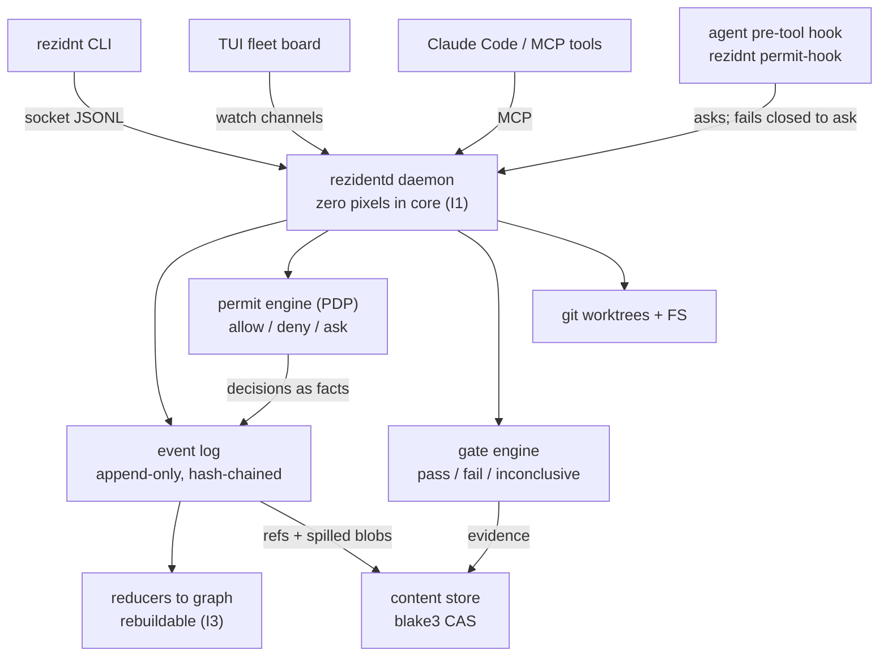

<div align="center">

# rezidnt

**A local-first resident daemon that runs, governs, verifies, and audits a fleet of coding agents.**

One Rust binary. Zero telemetry. Every fact about your fleet is an append-only, replayable event —
and every merged diff carries deterministic evidence a compliance reviewer will sign.

[Architecture](docs/rezidnt-architecture.md) · [Invariants](#the-eight-invariants-binding) · [Golden path](#the-golden-path-the-product-contract) · [Install](#install) · [Status](#status)

`Apache-2.0` · `edition 2024` · `v0.0.1` (pre-release)

</div>

---

## What it is

Four capabilities no current tool unifies, behind one daemon:

- **A typed event fabric** — every fact about the fleet, append-only, hash-chained, replayable. The log *is* the truth; all state is a pure fold over it and can be rebuilt from `seq 0` at any time.
- **A run substrate** — agents and their substrates run under restart-with-backoff supervision, like a session-scoped init. Kill the client mid-run; the daemon owns the process, and the run survives.
- **A permit engine** — policy decided *before* the act: tool allowlists, path scope, spend and risk caps, intent-lock (an agent's tools bound to the run's declared intent), and layered admin/dev/session precedence. Decisions are `allow | deny | ask`; an `ask` escalates to a human and the resolution folds back out of the log. The enforcement point rides the harness's pre-tool hook and fails **closed to `ask`** when the daemon is unreachable — never a silent proceed.
- **A verifier gate engine** — deterministic checks that emit *evidence, not vibes*, decided *after* the act. Verdicts are `pass | fail | inconclusive` — never a coerced boolean. `debrief` replays a recorded verdict from the log + content store; a divergence raises an integrity alarm.

Positioning, in one line: **permission before the act, evidence after it — one log, both.** Most tooling does one and treats the other as a report you have to trust. rezidnt decides and records them on the same append-only fabric, so the trail replays instead of being asserted.

**Containment (Linux/WSL).** The permit verdict is backed by more than cooperation: a governed run spawns inside `bwrap`, filesystem-confined, in a sealed network namespace — **deny-all egress** unless the project declares an `[egress]` allowlist. Absent config never means open. Sandbox unavailability degrades *loud-open* and egress unavailability degrades *closed*, each as a logged fact rather than a silent gap. Honest scope: the egress **decision** layer, the credential fold, and the composed spawn are live; the TLS-terminating proxy dataplane and live credential injection are **not yet the enforced byte-path** ([DR-027](docs/decisions/DR-027-c3bc-split-decide-enforce.md), [DR-028](docs/decisions/DR-028-c3-wire.md)). macOS and native Windows containment are unbuilt.

## How it fits together

Every UI is a client of the socket/MCP surface — the daemon itself renders nothing (I1). This diagram answers: *how does an agent reach the daemon, and what does the daemon own?*


```mermaid
flowchart TD
    CLI["rezidnt CLI"] -->|socket JSONL| DAEMON
    TUI["TUI fleet board"] -->|watch channels| DAEMON
    MCP["Claude Code / MCP tools"] -->|MCP| DAEMON
    HOOK["agent pre-tool hook<br/>rezidnt permit-hook"] -->|"asks; fails closed to ask"| DAEMON
    DAEMON["rezidentd daemon<br/>zero pixels in core (I1)"] --> LOG["event log<br/>append-only, hash-chained"]
    LOG --> GRAPH["reducers to graph<br/>rebuildable (I3)"]
    DAEMON --> PERMIT["permit engine (PDP)<br/>allow / deny / ask"]
    DAEMON --> GATE["gate engine<br/>pass / fail / inconclusive"]
    DAEMON --> GIT["git worktrees + FS"]
    PERMIT -->|decisions as facts| LOG
    GATE -->|evidence| CAS["content store<br/>blake3 CAS"]
    LOG -->|"refs + spilled blobs"| CAS
```

Both engines write their decisions to the one log — that is what makes "what was it allowed to do" and "what did it do" answerable from the same replay.

Control plane and data plane never mix (I2): the fabric carries facts and references; PTY bytes, diffs, and transcripts move out-of-band through the content-addressed store.

## The golden path (the product contract)

The whole project is judged against one demo, not a feature list — cold machine to first verified merged diff, one take, zero config edits, single-digit minutes. This is **BINDING**.


```mermaid
flowchart LR
    I["curl install"] --> O["rezidnt init"]
    O --> W["worktrees allocated"]
    W --> S["agents spawned<br/>under permits + gates"]
    S --> V["vet + pre_merge<br/>verifiers run"]
    V --> M["verified diff merged"]
    M --> DB["debrief<br/>replayable evidence"]
```

## The eight invariants (BINDING)

These are the load-bearing constraints; changing one requires a written decision record. Full text: [architecture §2](docs/rezidnt-architecture.md).

| # | Invariant | What it forbids |
|---|---|---|
| **I1** | Zero pixels in core | the daemon rendering anything; a UI forcing a daemon change |
| **I2** | Control/data plane never mix | PTY/diff bytes on the bus; payloads over 32 KiB (spill to CAS) |
| **I3** | The log is truth, state is derived | any state that can't be rebuilt from the log |
| **I4** | Substrates behind traits | hard-wiring git, herdr, or a harness as non-swappable |
| **I5** | MCP-first, UI-second | shipping a capability as a keybinding before an MCP tool |
| **I6** | Verifiers deterministic + interrogable | a gate that can't say why it blocked; coercing `inconclusive` |
| **I7** | One static binary, no telemetry | runtime deps, phone-home, hosted control plane |
| **I8** | AGPL firewall | reading, linking, or vendoring herdr (AGPL) source |

## Repository map

Cargo workspace, one repo. Library crates are `MIT OR Apache-2.0`; binaries `Apache-2.0`.

```text
rezidnt/
  install.sh               checksum-gated curl | sh installer (DR-037)
  bins/
    rezidentd/             the daemon — fabric, log, gate + permit engines, socket
    rezidnt/               the CLI — a socket client; start `rezidentd` yourself
  crates/
    rezidnt-types/         event envelope, subjects, id newtypes
    rezidnt-fabric/        append-only SQLite log, blake3 chain, broadcast, replay
    rezidnt-state/         pure reducers → materialized graph (CQRS-lite)
    rezidnt-proto/         socket protocol frames, versioned hello
    rezidnt-client/        shared socket-driving client (CLI + benchmark harness)
    rezidnt-cas/           content-addressed store (blake3)
    rezidnt-run/           run substrate: spawn, capture, reaper, sandbox, egress, secrets
    rezidnt-adapters/git/  gix reads, git-CLI mutations, worktree registry
    rezidnt-gate/          gate engine + permit engine — native + exec verifiers, evidence
    rezidnt-mcp/           MCP server (resources + tools)
    rezidnt-tui/           read-only ratatui fleet board
    rezidnt-testkit/       shared fixtures and test helpers
  bench/harness/           the public benchmark harness (the case set stays private)
  spec/
    ontology.md            subject taxonomy — the IP, versioned like code
    fixtures/              golden event-log replay fixtures
  docs/
    rezidnt-architecture.md   canonical design plan (§20 indexes the decisions)
    decisions/                one file per decision record (indexed by §20)
    design/                   design sketches that precede the larger decisions
    quickstart.md             cold machine to first gated run
    s3-demo-runsheet.md       Phase-1 exit demo run-sheet
  intel/                   clean-room competitor memos (DR-002 protocol)
  .claude/                 the build harness (see rezidnt-harness-README.md)
```

## The event model

A single envelope carries every fact ([architecture §5](docs/rezidnt-architecture.md)). Subjects are dot-namespaced, never renamed — only deprecated. Payloads evolve additively; reducers fold every live version.

```rust
pub struct Event {
    pub id: Ulid,                   // time-ordered, globally unique
    pub subject: Subject,           // e.g. agent.status.changed
    pub correlation: Ulid,          // groups one causal chain (an open, a gate run)
    pub causation: Option<Ulid>,    // the event that directly triggered this one
    pub payload: serde_json::Value, // <= 32 KiB; larger content becomes a CAS ref
    // ...id, ts, v, source, workspace
}
```

Materialized state is a pure fold: `fn apply(&mut Graph, &Event)`. `rezidnt rebuild` refolds from `seq 0`; a rebuild that diverges from the running graph is a release-blocking reducer bug.

## CLI

Every reporting verb takes `--json`; exit codes are stable and ratified (DR-004): `0` ok · `1` internal error · `2` local input/usage · `3` substrate fault (incl. daemon refusals & `inconclusive`) · `4` daemon unreachable · `5` gate-fail.

```text
rezidnt init [dir]           cold start: doctor → spec init → open, one command
rezidnt doctor               read-only environment preflight (no daemon, no network)
rezidnt spec init [dir]      generate the rezidnt.toml the golden path opens untouched
rezidnt open <spec>          materialize a workspace, spawn agents under gates
rezidnt tail [--subject …]   stream the live event fabric
rezidnt attach <run>         replay a run's capture tail, then stream live bytes
rezidnt board                read-only ratatui fleet board
rezidnt vet <spec>           run the pre-spawn policy gate over a spec's agents
rezidnt verify <name>        run a production verifier, emit a §8 verdict document
rezidnt debrief <run>        replay recorded verdicts; alarm on divergence
rezidnt gate why <run>       the failing verifier, evidence, and exact inputs
rezidnt operator …           kill a run, resolve an escalated permit (badged)
rezidnt rebuild              refold state from seq 0 and print the graph
rezidnt mcp                  MCP over stdio for a local client to spawn
rezidnt permit-hook          the pre-tool enforcement point a harness hook invokes
```

`verify` is the v1 verifier pack (DR-041): `cargo-test`, `clippy`, `fmt-check`, `dependency-audit`. Each maps its tool's result to the three-valued verdict — a tool that cannot reach a conclusion returns `inconclusive` on stdout, never a coerced `pass` and never an error exit.

## Install

Linux and WSL2, `x86_64`. The script verifies the published sha256 before it installs anything, and sends no telemetry.

```bash
curl -fsSL https://raw.githubusercontent.com/rezidnt/rezidnt/main/install.sh | sh
export PATH="$HOME/.local/bin:$PATH"   # the installer's default dir; it only warns if unset
cd /path/to/your-repo                  # the DAEMON resolves the spec's repo = "." against its own cwd
rezidentd &                            # so start it from the repo root, and leave it running
rezidnt init                           # doctor → spec → first gated run
```

The installer places two binaries: `rezidentd` (the daemon) and `rezidnt` (the CLI), in `~/.local/bin`
unless you set `REZIDNT_INSTALL_DIR`. The CLI is only a client of the daemon's socket and never starts
it, so a missing daemon is what `rezidnt init` reports, exiting `4` (daemon-unreachable). Of the
preflight checks, only `git` missing from `PATH` stops `init` outright on a default machine (exit `3`);
the harness and socket-path checks report `inconclusive` there, as does the WSL check unless you are
on a WSL2 kernel, and `init` prints those as warnings and proceeds past — never coerced to a pass (I6). `rezidnt doctor` treats *any* non-pass as
exit `3`, so it can exit non-zero on a perfectly healthy machine. `init` also prompts for the spec
fields on stdin unless you pass `--defaults`.

Walkthrough: [docs/quickstart.md](docs/quickstart.md). macOS and native-Windows artifacts are deferred (DR-037) — build from source there.

## Build

Requires a recent stable Rust toolchain (edition 2024).

```bash
cargo build --workspace
cargo test --workspace
```

The full local verifier gauntlet — `fmt`, `clippy -D warnings`, tests, and golden-fixture replay — is one command:

```bash
bash .claude/hooks/vet.sh
```

> **Platform note.** Linux and macOS run the daemon natively. On Windows, the Phase-1 topology runs the daemon and substrates inside WSL2 with Windows-side clients reaching it over loopback; a native-Windows daemon (ConPTY, named pipes) is a Phase-3 goal. Containment (`bwrap` confinement, sealed netns) is **Linux/WSL only** — elsewhere a run spawns unconfined and says so in the log.

## Status

Pre-release (`v0.0.1`). Slices are "done" only when their acceptance criteria pass the gauntlet **and** a read-only auditor's verdict — never a feature checklist.

| Arc | Scope | State |
|---|---|---|
| **S0** | ontology + envelope + log + broadcast + `tail` | ✅ complete |
| **S1** | run substrate + `open` materialization | ✅ complete |
| **S2** | git adapter + sole-allocator worktree registry | ✅ complete |
| **S3** | MCP surface + `attach` | ✅ complete |
| **S4** | gate engine — verified merged diff + replayable `debrief` | ✅ complete (golden path) |
| **S5** | ratatui read-only fleet board | ✅ complete |
| **Permit engine** | PDP/PEP split, roles + delegation, intent-lock, spend/risk caps, layered precedence (DR-008..024) | ✅ complete |
| **Containment** | `bwrap` confinement + sealed netns; egress decision layer + credential fold (DR-025..030) | ◐ confinement live; mediating proxy dataplane outstanding |
| **Onboarding + install** | `doctor` / `spec init` / `init`; checksum-gated installer (DR-036/037) | ✅ complete |
| **Verifier pack v1** | `rezidnt verify` — cargo-test, clippy, fmt-check, dependency-audit (DR-041) | ✅ complete |
| **Phase 3 — orchestrator** | live lead→sub fan-out over the worktree registry (DR-042/044/046) | ◐ in progress |
| **Phase 3 — terminal substrate** | owned VT kernel, native Windows | not started |

Phase 2's exit criterion is met: the benchmark harness in `bench/harness` drives a real daemon end-to-end. Phase 3 opened on that basis, taking the orchestrator arc first; the owned terminal substrate is the other, larger Phase-3 arc and is not superseded (DR-044).

Sequencing law: **fabric → gates → terminal.** Any pressure to reorder gets the phase-exit-demo test.

## Documentation

- **[docs/rezidnt-architecture.md](docs/rezidnt-architecture.md)** — the canonical design plan: invariants, topology, the fabric and gate engine, the phased roadmap, and (§20) the index to the decision records. Everything else is its distillation.
- **[docs/decisions/](docs/decisions/)** — the decision records, one per file, indexed by [architecture §20](docs/rezidnt-architecture.md): the dated, append-only amendments to the plan. A plan section marked "amended by DR-0NN" defers to its record. Each carries its strongest counterargument verbatim.
- **[spec/ontology.md](spec/ontology.md)** — the subject taxonomy; treated as the crown-jewel IP and versioned like code.
- **[docs/quickstart.md](docs/quickstart.md)** — cold machine to first gated run.
- **[docs/s3-demo-runsheet.md](docs/s3-demo-runsheet.md)** — the Phase-1 exit demo run-sheet (one-take recorded golden-path walkthrough).
- **[rezidnt-harness-README.md](rezidnt-harness-README.md)** — building rezidnt with the Claude Code agent-team harness (agents, skills, hooks, the maker–checker loop).

## Licensing

Apache-2.0 at the root; `MIT OR Apache-2.0` on `crates/*` libraries. See [`LICENSE`](LICENSE), [`LICENSE-MIT`](LICENSE-MIT), [`CONTRIBUTING.md`](CONTRIBUTING.md) (DCO enforced), [`SECURITY.md`](SECURITY.md), and [`TRADEMARKS.md`](TRADEMARKS.md) (mark owned by TwofoldTech LLC). A `NOTICE` file carrying attributions is added when any third-party code is first ported.
